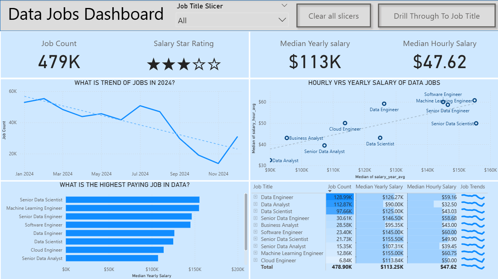
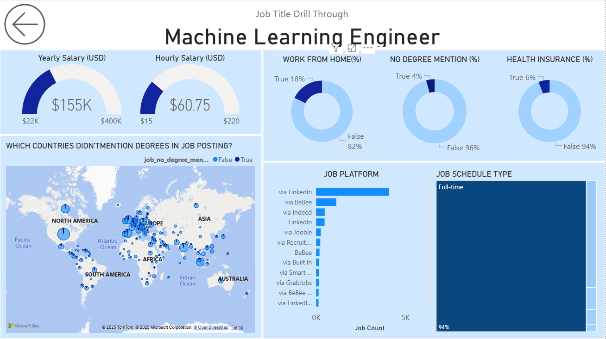

# Data Jobs Dashboard (Power BI)

Short, focused Power BI report summarizing the data & analytics job landscape: roles, (where available) pay bands, skills frequency, and remote / hybrid share.

	

---
## What It Answers Quickly
Overview page (first image):
- How many postings are there overall and how is volume trending?
- Which roles dominate the market right now?
- What share of listings are remote / hybrid?
- Where (regions / countries) are roles concentrated?

Role detail page (second image):
- For a chosen role, what skills show up most frequently?
- What is the remote vs onsite split for that role?
- (If present) How do salaries or ranges look for that role?
- In which regions is that role most active?

---
## Open the Report
File: `Data Jobs Dashboard.pbix`
1. Open in the latest Power BI Desktop.
2. Adjust slicers (Role / Region / Date) to refine context.
3. Use drill-through on a role (if enabled) for detail breakdown.

---
## Screenshots (Full)
**Overview Page**

**Role Detail Page**

_Each screenshot above maps directly to the question sets listed in the section "What It Answers Quickly."_

---
## Data Source (Brief)
High-level description of origin (public dataset / compiled export / synthetic). No personal or sensitive data included. Replace this sentence once you publish.

---
## Core Techniques
- Power Query for basic cleaning & derived flags (e.g., Remote / Hybrid)
- Simple measures (counts, distinct counts, % share, optional medians)
- Standard visuals (cards, columns, lines, table, map)
- Drill-through for context shift from summary to role detail

---
## Optional Future Enhancements
- Key takeaways card (static text table)
- MoM / YoY % change measures
- Synthetic sample dataset (if original cannot be shared)

---
## Acknowledgments
Special shoutout to **Luke Barousse** for the guidelines, data resources, and tutoring inspiration that helped shape this project.

---
## Author
Your Name (add LinkedIn / portfolio later if desired)

---
Ready to use. Add a hosted link later if you publish online.
